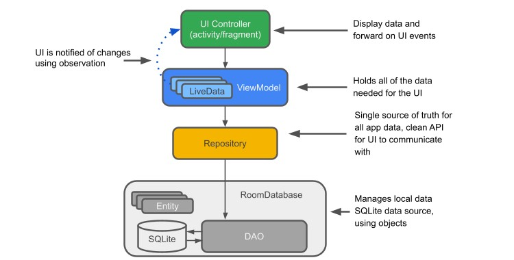

# TakeNotes
#### Full Stack Android App

### This is a full-stack application that is quite similar to the notes taking app of our android sets.

## The Plan to carry out this project is as follows:

 

   It works on Android Architecture Components.
   The app uses a real time database in the backend where a user can write and save their notes. On refreshing the app, all their data remain intact.
   If the user decides to delete a particular note, then that data is removed from the database.
   
   
