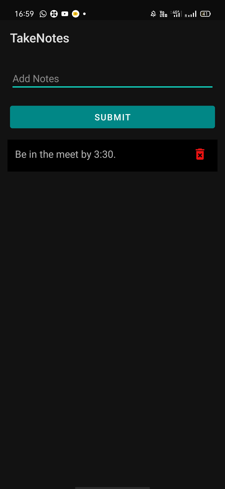

# Full Stack Android App
## TakeNotes 

#### About
   This is a full-stack application that is quite similar to the notes taking app of our android sets.
   
#### Tools and Languages Required
<list>
  <ul>
    <li>Android Studio</li>
    <li>Kotlin</li>
    <li>xml</li>
    <li>recycler view</li>
    <li>Layout manager</li>
    <li>Android architecture</li>
    <li>Room Database</li>
    <li>DAO</li>
    <li>Repository</li>
    <li>View Model</li>
    <li>UI</li>
  </ul>
  </list>
<h4 align="center"> The Plan to carry out this project is as follows:</h4>

 

It works on Android Architecture Components. The app uses a real time database in the backend where a user can write and save their notes. On refreshing the app, all their data remain intact. If the user decides to delete a particular note, then that data is removed from the database.

### RoomDatabase
   Room is basically a wrapper over sqlite. We access the data of Room using DAO    i.e., Data Access Object.

### Repository
   A single source of truth for data, that handles data coming from multiple places.

### View Mode
   View model seperates data from activity. This is known as seperation of concern.
   It is made LIVECYCLE AWARE, i.e., change of data is appeared in real time.
   It does not destroy, data and recreates new data while we rotate our phone from    portrait to landscape mode.
   It survives the configuration change.

### UI Controller
  This is the part of the application that gets displyed.
   
   
   
<h3 align="center">Output Images:</h3>
 

 

  

  

